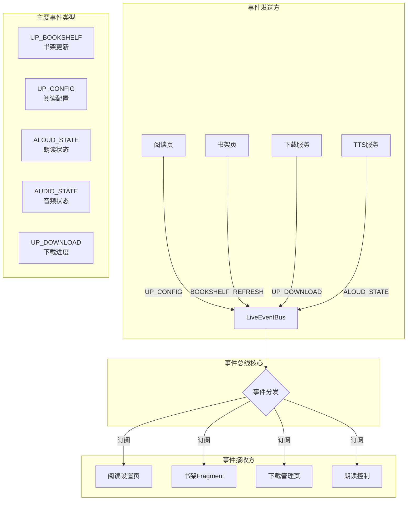

# Legado 事件总线通信机制



## 事件总线详解

### 1. LiveEventBus 概述

Legado 使用 `LiveEventBus` 作为事件总线框架，基于 LiveData 实现。

#### 特点

- **生命周期感知**: 自动管理订阅生命周期
- **粘性事件**: 支持粘性事件，新订阅者可收到最近事件
- **线程安全**: 支持跨线程通信
- **类型安全**: 支持泛型，类型安全

#### 配置

```kotlin
LiveEventBus.config()
    .lifecycleObserverAlwaysActive(true)  // 观察者始终活跃
    .autoClear(false)                     // 不自动清除粘性事件
    .enableLogger(BuildConfig.DEBUG)      // 启用日志
    .setLogger(EventLogger())             // 自定义日志
```

### 2. 事件定义 (EventBus)

所有事件常量定义在 `EventBus` 对象中：

```kotlin
object EventBus {
    // ── 通用 ──
    const val RECREATE = "RECREATE"                     // 重建Activity
    const val NOTIFY_MAIN = "notifyMain"                // 通知主界面
    const val WEB_SERVICE = "webService"                // Web服务状态
    const val DEBUG_MODE_CHANGED = "debugModeChanged"   // 调试模式变化

    // ── 书架 ──
    const val UP_BOOKSHELF = "upBookToc"               // 书籍目录更新
    const val BOOKSHELF_REFRESH = "bookshelfRefresh"   // 书架列表刷新
    const val SOURCE_CHANGED = "sourceChanged"         // 书源变更
    const val REFRESH_BOOK_INFO = "refreshBookInfo"    // 刷新书籍信息
    const val REFRESH_BOOK_CONTENT = "refreshBookContent" // 刷新书籍内容
    const val REFRESH_BOOK_TOC = "refreshBookToc"      // 刷新书籍目录

    // ── 阅读页 ──
    const val UP_CONFIG = "upConfig"                   // 阅读配置变更
    const val UPDATE_READ_ACTION_BAR = "updateReadActionBar" // 阅读栏更新
    const val UP_SEEK_BAR = "upSeekBar"                // 阅读进度条更新
    const val TIP_COLOR = "tipColor"                   // 提示文字颜色
    const val UP_MANGA_CONFIG = "upMangaConfig"        // 漫画配置更新
    const val MEDIA_BUTTON = "mediaButton"             // 媒体按钮事件

    // ── 朗读/TTS ──
    const val ALOUD_STATE = "aloud_state"              // 朗读状态
    const val TTS_PROGRESS = "ttsStart"                // TTS进度
    const val READ_ALOUD_DS = "readAloudDs"            // 朗读数据源
    const val READ_ALOUD_PLAY = "readAloudPlay"        // 朗读播放控制

    // ── 音频播放 ──
    const val AUDIO_DS = "audioDs"                     // 音频数据源
    const val AUDIO_STATE = "audioState"               // 音频状态
    const val AUDIO_SUB_TITLE = "audioSubTitle"        // 音频字幕
    const val AUDIO_PROGRESS = "audioProgress"         // 音频进度
    const val AUDIO_BUFFER_PROGRESS = "audioBufferProgress" // 缓冲进度
    const val AUDIO_SIZE = "audioSize"                 // 音频总时长
    const val AUDIO_SPEED = "audioSpeed"               // 播放速度
    const val PLAY_MODE_CHANGED = "playModeChanged"    // 播放模式

    // ── 视频播放 ──
    const val VIDEO_SUB_TITLE = "VideoSubTitle"        // 视频字幕
    const val UP_VIDEO_INFO = "upVideoInfo"            // 视频信息
    const val VIDEO_CONFIG_CHANGED = "videoConfigChanged" // 视频播放器配置变化

    // ── 系统 ──
    const val BATTERY_CHANGED = "batteryChanged"       // 电池变化
    const val TIME_CHANGED = "timeChanged"             // 时间变化

    // ── 下载/导出 ──
    const val UP_DOWNLOAD = "upDownload"               // 下载更新
    const val UP_DOWNLOAD_STATE = "upDownloadState"    // 下载状态
    const val SAVE_CONTENT = "saveContent"             // 保存内容
    const val EXPORT_BOOK = "exportBook"               // 导出书籍

    // ── 校源 ──
    const val CHECK_SOURCE = "checkSource"             // 开始校源
    const val CHECK_SOURCE_DONE = "checkSourceDone"    // 校源完成

    // ── 搜索 ──
    const val SEARCH_RESULT = "searchResult"           // 搜索结果
}
```

### 3. 事件发送

#### 基本发送

```kotlin
import io.legado.app.utils.postEvent

// 发送事件
postEvent(EventBus.BOOKSHELF_REFRESH, "")
postEvent(EventBus.UP_CONFIG, arrayListOf(1, 2, 5))
postEvent(EventBus.ALOUD_STATE, true)
```

#### 发送粘性事件

```kotlin
// 粘性事件：新订阅者可收到最近一次事件
LiveEventBus.get(EventBus.AUDIO_STATE)
    .postAcrossProcess(audioState)
```

### 4. 事件订阅

#### 在 Activity/Fragment 中订阅

```kotlin
class ReadActivity : BaseActivity() {
    
    override fun onCreate(savedInstanceState: Bundle?) {
        super.onCreate(savedInstanceState)
        
        // 订阅阅读配置变更事件
        observeEvent<List<Int>>(EventBus.UP_CONFIG) { configTypes ->
            // 处理配置变更
            configTypes.forEach { type ->
                when (type) {
                    1 -> updateTextStyle()
                    2 -> updateBackground()
                    5 -> updatePageAnim()
                }
            }
        }
        
        // 订阅朗读状态事件
        observeEvent<Boolean>(EventBus.ALOUD_STATE) { isPlaying ->
            updateAloudButton(isPlaying)
        }
    }
}
```

#### 在 ViewModel 中订阅

```kotlin
class MainViewModel : BaseViewModel() {
    
    init {
        // 订阅书架刷新事件
        observeEvent<String>(EventBus.BOOKSHELF_REFRESH) {
            refreshBookshelf()
        }
        
        // 订阅书源变更事件
        observeEvent<String>(EventBus.SOURCE_CHANGED) {
            loadBookSources()
        }
    }
}
```

### 5. 典型使用场景

#### 场景1：阅读配置变更

```kotlin
// 发送方：阅读设置页
fun changeFontSize(size: Int) {
    ReadBookConfig.textSize = size
    postEvent(EventBus.UP_CONFIG, arrayListOf(1))
}

// 接收方：阅读页
observeEvent<List<Int>>(EventBus.UP_CONFIG) { types ->
    if (types.contains(1)) {
        updateTextStyle()
    }
}
```

#### 场景2：书架刷新

```kotlin
// 发送方：添加书籍后
fun addToBookshelf(book: Book) {
    bookDao.insert(book)
    postEvent(EventBus.BOOKSHELF_REFRESH, "")
}

// 接收方：书架Fragment
observeEvent<String>(EventBus.BOOKSHELF_REFRESH) {
    viewModel.loadBooks()
}
```

#### 场景3：朗读状态同步

```kotlin
// 发送方：TTS服务
class TTSReadAloudService : BaseReadAloudService() {
    
    fun play() {
        tts.speak(text, TextToSpeech.QUEUE_ADD, null)
        postEvent(EventBus.ALOUD_STATE, true)
    }
    
    fun pause() {
        tts.stop()
        postEvent(EventBus.ALOUD_STATE, false)
    }
}

// 接收方：阅读页
observeEvent<Boolean>(EventBus.ALOUD_STATE) { isPlaying ->
    btnAloud.setImageResource(
        if (isPlaying) R.drawable.ic_pause
        else R.drawable.ic_play
    )
}
```

#### 场景4：下载进度更新

```kotlin
// 发送方：下载服务
class DownloadService : BaseService() {
    
    fun updateProgress(download: Download) {
        postEvent(EventBus.UP_DOWNLOAD, download)
    }
}

// 接收方：下载管理页
observeEvent<Download>(EventBus.UP_DOWNLOAD) { download ->
    adapter.updateDownload(download)
}
```

### 6. 事件总线 vs 其他通信方式

| 方式 | 适用场景 | 优点 | 缺点 |
|------|---------|------|------|
| **EventBus** | 跨组件、跨页面通信 | 解耦、简单 | 难追踪 |
| **LiveData** | ViewModel到View | 生命周期感知 | 仅限同生命周期 |
| **接口回调** | 一对一通信 | 直接、清晰 | 耦合度高 |
| **Broadcast** | 跨进程通信 | 系统级 | 性能差 |

### 7. 最佳实践

#### 避免滥用

```kotlin
// ❌ 不推荐：简单操作使用EventBus
postEvent("UPDATE_TEXT", newText)

// ✅ 推荐：直接调用
textView.text = newText
```

#### 事件携带数据

```kotlin
// ❌ 不推荐：多个事件
postEvent("UPDATE_NAME", name)
postEvent("UPDATE_AUTHOR", author)

// ✅ 推荐：一个事件携带多个数据
postEvent("UPDATE_BOOK_INFO", BookInfo(name, author))
```

#### 及时取消订阅

```kotlin
// Activity/Fragment 中自动管理
// 无需手动取消

// 在普通类中需要手动取消
override fun onDestroy() {
    LiveEventBus.get(EventBus.AUDIO_STATE)
        .removeObserver(observer)
}
```

### 8. 调试技巧

```kotlin
// 启用EventBus日志
LiveEventBus.config()
    .enableLogger(true)
    .setLogger(object : DefaultLogger() {
        override fun log(level: Level, msg: String) {
            LogUtils.d("EventBus", msg)
        }
    })
```

### 9. 性能优化

- **避免频繁发送**: 合并高频事件
- **轻量级数据**: 事件携带轻量数据
- **及时清理**: 不用的订阅及时清理
- **异步处理**: 耗时操作异步执行
